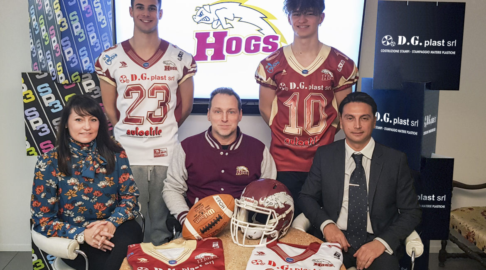

   

Sono pronti a iniziare il campionato 2019 gli Hogs Reggio Emilia, il football americano targato RE torna in campo domenica nella prima insidiosa trasferta stagionale.  
  
In settimana il campionato di 2° divisione che sta per iniziare è stato presentato dal presidente Ruozzi insieme ai nuovi sponsor e alle nuove divise di gioco che accompagneranno gli Hogs in questa stagione.  
  
Una stagione di svolta con un nuovo coaching staff d’attacco con l’offensive coordinator Lazzaretti Leonardo e il coach delle linee Giovanni Modena. Difesa, come sempre, sotto la guida di Daniele Rossi, confermato anche come head coach del team.  
  
Quest’anno main sponsor sarà la DG Plast che campeggia sulle nuove divise insieme a Studio Pubblicità 3 e Formoso.  
  
Gli storici partner Civiemme, Guglielmo, Autostile,e Vecchi continuano a dare fiducia al progetto granata e restano sponsor del team. Quest’anno il girone in cui sono chiamati a giocare i ragazzi di coach Rossi è sempre più difficile, con ben 3 squadre su 5 che lo scorso anno sono arrivate ai play off.
  
Infatti i reggiani nella regular season se la dovranno vedere con Braves Bologna, Pretoriani Roma, Redjackets Sarzana e Vipers Modena.   Quindi oltre ai due derby la sfida con i romani finalisti dello scorso anno e i liguri, che saranno i primi a ospitare i granata.  
  
Debutto domenica 3 marzo alle 14.30 a Sarzana dove si testerà il nuovo sistema di gioco d’attacco e la difesa potrà vedere se i giovanissimi arrivati dall’under 19 saranno pronti per giocare in senior.  
  

     
*Ufficio Stampa Hogs Reggio Emilia*