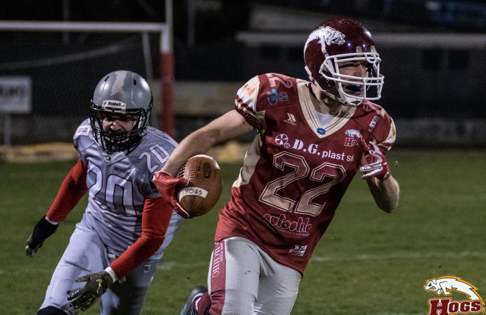
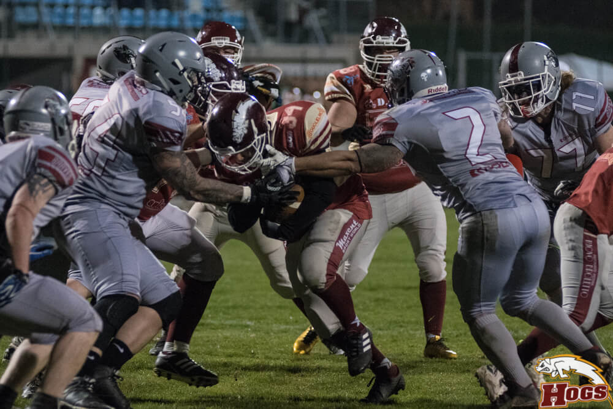
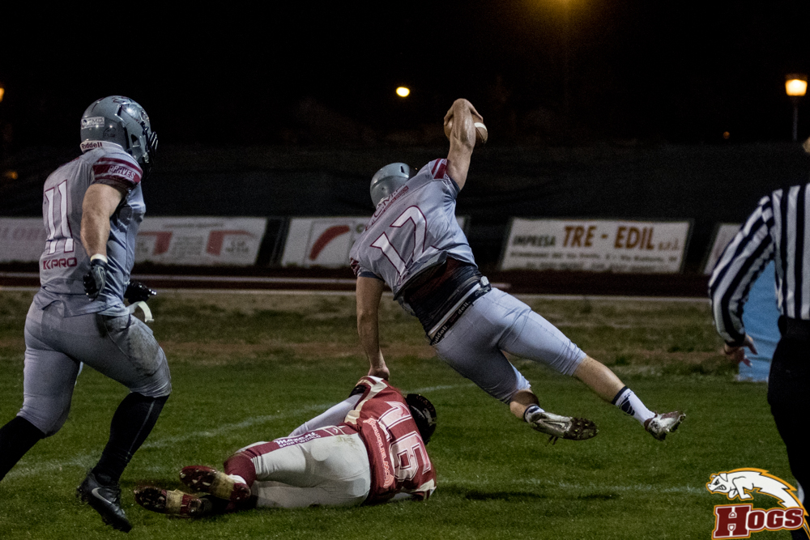
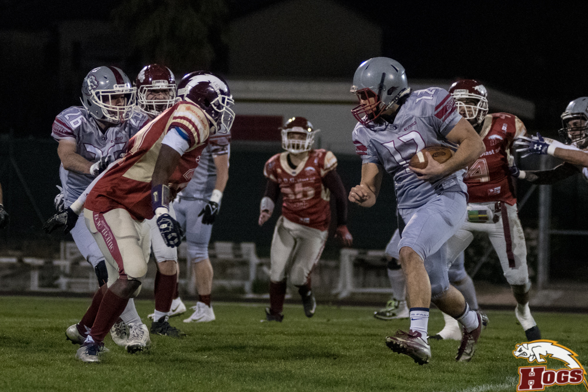

   

Ancora una volta uno scatto sul filo di lana premia la perseveranza dei DG PLAST Hogs che per tre volte hanno rincorso i Braves Bologna per poi mettere definitivamente la testa avanti negli ultimi 2 minuti ed imporsi col punteggio di 37 a 33.  
Il totale dei punti segnati la dice lunga del dominio degli attacchi sulle difese.  La partita inizia con un botta e risposta che sarà il filo conduttore dei 4 quarti.  
Aprono gli Hogs con Camposano che grazie all’ottimo lavoro della linea d’attacco finalizza con una corsa da 2 yard un drive che mette in evidenza anche i lanci di Ruozzi. Calcia Cebotaru e Hogs avanti per 7 a 0.  

 

   

Immediata la risposta dei Braves, che pur schierandosi con  3 o 4 ricevitori alla fine costruiscono sulle corse il pareggio grazie a Iannoni e il calcio di Ferri. Nel secondo quarto uno stop a testa per le difese e sia Hogs che Braves mandano in campo il punt team.  Due nomi su tutti i DL Blozovsky (Braves #77) e Amparo Acevedo (Hogs # 99), probabilmente gli MVP di difesa per le due squadre.  
  
+fiorillo tdNuovo vantaggio Hogs sempre con Camposano e Cebotaru , ma poco prima dell’intervallo i Braves su un 4° down decidono di giocare per il touchdown ed è lo stesso QB Conticello a segnare su corsa, poi arriva il calcio di Ferri: parità perfetta.
Alla ripresa del 3° quarto il gioco in option dell’attacco dei Braves si rivela un rompicapo per la difesa di casa ed arriva il primo vantaggio degli ospiti col RB Iannotta, ma è fuori il calcio di Ferri. Kick off e Maestri (# 22 Hogs) maltratta il pallone, lo recupera e poi corre per 80 yard in TD: il calcio di Cebotaru riporta avanti i padroni di casa per 21 a 20. Ma è la volta di Bilacchi che riporta avanti i Braves su corsa, fermato il tentativo da 2 punti: Braves 26 Hogs 21.  
  
Inizia l’ultimo quarto di gioco e ci si affida all’influenzato Fiorillo, Si arriva ad un 1° e goal ed è proprio lui (la settimana scorsa ha raggiunto le 3.000 yard in carriera, all time leader degli Hogs) che segna. Si va da 2 punti e Maestri entra in end zone: avanti ancora Hogs per 29 a 26.  
Sono obbligati a cercare il TD i Braves e ci riescono col WR Amidei e grazie al calcio di Ferri vanno a +4 sui DG PLAST HOGS :33 a 29.
Poco più di due minuti e gli Hogs costruiscono un ultimo drive partendo dalle 40. Alla fine è ancora Fiorillo a segnare su corsa. Avanti di 2 i coach di Reggio decidono di rischiare e vanno per la conversione da 2 punti, che riesce con la corsa laterale con tuffo finale di Buriani. Hogs-Braves 37 a 33.  
  

 

   

Meno di un minuto alla fine, ma visto l’andamento della partita non c’è da essere sicuri di nulla. Un kick off millimetrico di Cebotaru rotola in end zone per un pelo accarezzando il piloncino.  

 

   

Dalle proprie 20 yard i Braves sono con le spalle al muro, ma Conticello dopo essere sgusciato via dalla pressione della difesa trova profondo Bilacchi: si potrebbe pensare ad un paio di tentativi in end zone , ma la flag per holding vanifica la bella ricezione. Un paio di tentativi disperati ed arriva il fischio finale.  

Partita davvero sempre in equilibrio.  Ad entrambe le squadre, ma soprattutto agli Hogs è mancata continuità e consistenza nel gioco aereo: le giocate in option del QB bolognese Conticello sono state la vera spina nel fianco per la difesa dei porcellini.  
  
Si è però trattato di una novità rispetto alle prime due partite dei Braves e quindi gli aggiustamenti difensivi sono avvenuti in corso d’opera.  
  
Bel segnale comunque dei giovani Hogs che dopo il 24 a 22 sui Pretoriani s’impongono un’altra volta alla fine, segno quindi di una grande maturità e capacità di continuare a giocare con lucidità fino all’ultimo minuto.  
  
Ora gli Hogs sono in vetta da soli al loro girone con 3 vittorie in altrettanti incontri, ma la strada per i play off è lunghissima. La prossima domenica trasferta da brividi sul campo dei Vipers, altro derby e speriamo altra bella partita.  
  
  
*Ufficio Stampa Hogs Reggio Emilia*