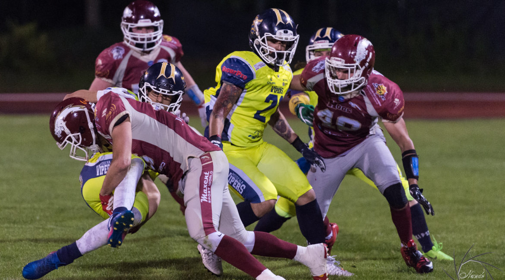
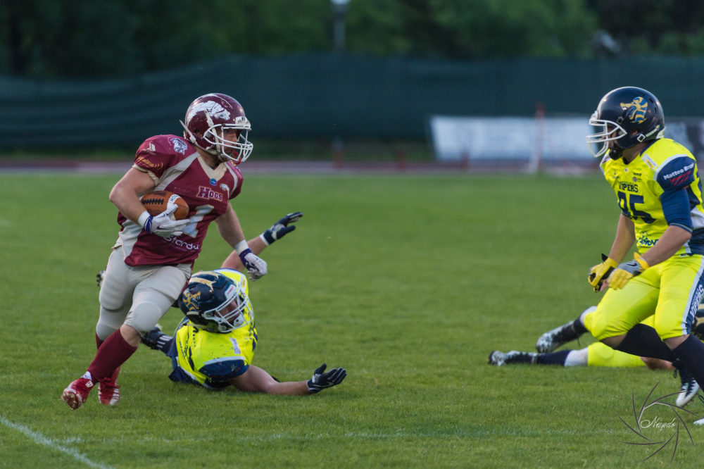
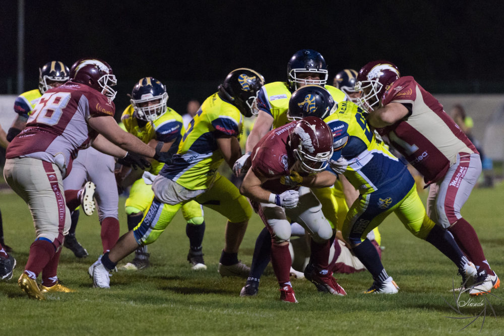

   

Ci sono partite che valgono una stagione e partite che aspetti per una stagione. Probabilmente il derby DG Plast Hogs-Vipers appartiene alla seconda categoria.  
  
Dopo oltre 20 anni, nel 2014 si ricostituiscono i Vipers Modena e bastano 2 anni (2017 e 2018) per creare una rivalità agonistica degna degli scontri ultracentenari di football fra certe università made in USA. Nulla a che fare con alcuni brutti spettacoli del calcio con la palla tonda, solo un carico di emozioni ed agonismo che si è trasmesso a tutti i livelli nelle due squadre, dall’addetto alle statistiche, fino al capo allenatore. Da quando sono iniziate le attività giovanili ad agosto, siamo quasi certi che Daniele Rossi (Hogs) e Tony Mangiafico (Vipers) un block notes con degli appunti per quest’incontro lo hanno sempre tenuto a portata di mano e aggiornato. Del resto dopo 4 stagioni il coach d’attacco dei Vipers Lazzaretti è “tornato a casa” ad allenare gli Hogs, dove per 20 anni aveva giocato con lo storico modulo d’attacco della Wing-T, che era lo stesso dei Vipers.A Modena però ci sono grandi progetti e sono arrivati nomi importanti alla corte del presidente Montaruli: il QB Malta e la DL Bernardoni pluricampione d’Italia e nazionale azzurro. Cambiato radicalmente il modulo d’attacco.  
  
 

   

Gli Hogs, con le due vittorie tiratissime su Pretoriani e Braves si presentano come primi del girone e imbattuti. Un poco a sorpresa i Vipers sono finora andati a corrente alternata, battuti, ma solamente di misura, proprio da Pretoriani e Braves. DG Plast Hogs favoriti ? Solamente sulla carta e ne è fermamente convinto il coach dei porcellini Giovanni Modena, italiano, emigrato in Francia e Canada con esperienze di alto livello in entrambi i paesi e chiamato espressamente per allenare le linee e curare tutto il settore giovanile. L’incredibile miscuglio di italiano, francese ed inglese di coach Modena ci ha dato un poco da fare, ma questo è il suo punto di vista :”Gli Hogs hanno avuto una partenza sorprendente- dice coach Modena-, frutto di una gran preparazione, concentrazione e un pizzico di fortuna. Con 6 punti di differenza abbiamo vinto 2 partite (Pretoriani e Braves) e sempre nei minuti finali. La stessa cosa è capitata ai Vipers, che forse sono anche stati un poco sfortunati. Domenica ( 7 aprile ore 14.30 a Modena) in caso di partita equilibrata, un fallo, uno special team, un turn over potrebbero essere decisivi.  

 

   

I Vipers hanno sicuramente pagato qualcosa all’introduzione del nuovo sistema d’attacco, ma domenica avranno nelle gambe due settimane dedicate solo agli allenamenti e recupereranno giocatori importanti, specialmente in difesa. Si tratta di una squadra con parecchi giocatori di categoria superiore, ma che probabilmente si stanno ancora amalgamando.”
  
E invece, i tuoi giocatori coach Modena, come stanno?  
  
“Sentono molto la partita, come del resto sono sicuro quelli di Modena. Fino ad ora il reparto con maggior continuità è stato quello della linea d’attacco, dove a parte Bondi e Mazzani i giovani hanno davvero sorpreso. Camorani., Matias, Raffaelli, Rozzi e Bertagnini hanno davvero permesso una maggiore varietà di giochi quest’anno. Pretendo molto e non uso mezzi termini durante gli allenamenti, ma i risultati ripagano.”  
  
Se per l’attacco sarà dura reggere lo scontro con la DL dei Vipers, non dormiranno sonni tranquilli i giocatori del backfield di difesa: in 3 partite il QB Malta ha già lanciato oltre 600 yard. Non è difficile indovinare chi sarà il giocatore da mettere sotto pressione. Non sarà una partita come le altre, però speriamo possa essere un’altra bella partita per tutti i tifosi granata che vorranno venire in trasferta a tifare HOGS.  
  
    
*Ufficio Stampa Hogs Reggio Emilia*