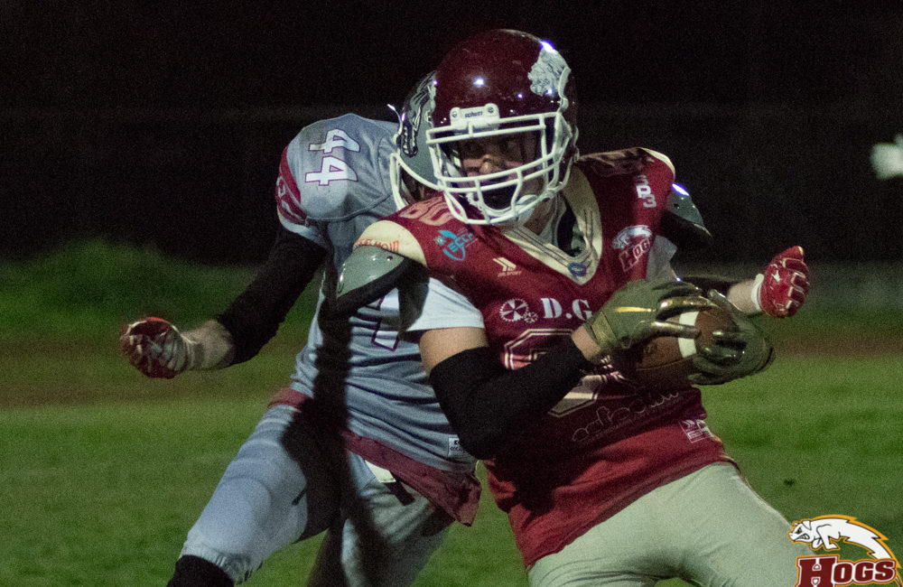
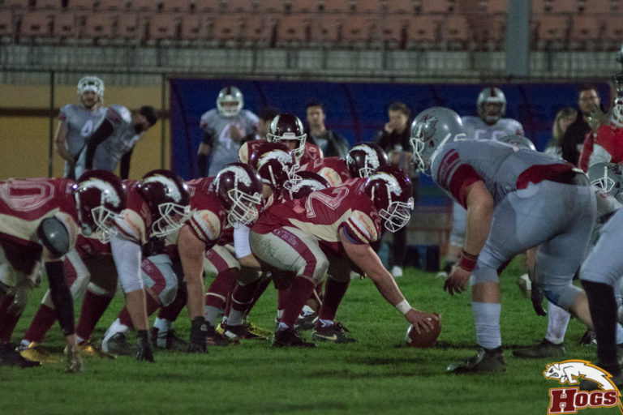
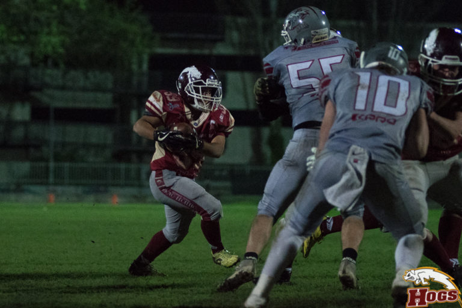
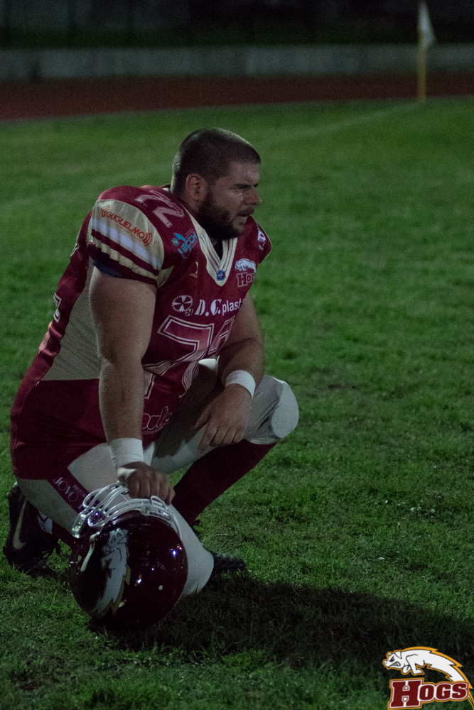

   

Come all’andata, uno splendido batti e ribatti nel corso dei 4 quarti porta i Braves a tentare l’ultimo assalto a meno di un minuto dalla fine, con soli 6 punti da recuperare.
43 secondi che si dilatano come solo nel football americano può accadere, ma alla fine i bambini con la faccia sporca di Reggio (la barba va di moda anche tra gli under 18) festeggiano la quinta vittoria consecutiva imponendosi per 35 a 29.  
Vittoria arrivata al cospetto di un avversario, i Braves, che ha sfoderato una prestazione maiuscola, con un roster davvero risicato: solamente 22 giocatori. La connessione aerea fra il QB Conticello e il WR Ferri ha prodotto 3 TD pass mentre il piede di Ferri ha poi aggiunto 2 extra point e 1 field goal: che dite vanno bene 23 punti?  
Gli Hogs, pur giocando un primo tempo in chiaro scuro sono riusciti a rimanere sempre vicini nel punteggio, tranne che dalla metà del 3° quarto quando per 2 volte hanno dovuto rimontare un gap di 9 punti.  
Problemi dall’inizio per l’offense reggiana: crampi a go go per il QB titolare Ruozzi. Si parte col secondo QB Cosimo, al rientro dopo anni di pausa e soli 4 allenamenti sulla spalliera. Il veterano che fra 3 anni potrà disputare il campionato over 45 sorprende tutti con due bei completi. Manca però il timing coi RB e si va al punt.  
  
 

   

La defense con Bedogni ferma un 4° tentativo giocato dai Braves e rientra l’attacco che però perde palla con un fumble ricoperto dal bolognese Castellari.  
Rompe gli indugi Conticello e primo TD pass per Ferri. Un bel ritorno del # 32 “Brontolo” Ghirri consente al titolare Ruozzi una partenza tranquilla per l’offense granata. Massaggiato, riempito di sali e banane trova il vantaggio con uno splendido pass da 35 yard per Montecchi e arriva il vantaggio con l’EP di Cebotaru.  
Nemmeno il tempo di allacciarsi le scarpe: bomba di Conticello da 50 yard per Ferri, che però ancora manca il calcio. Di nuovo sugli scudi il rookie Ghirri e Hogs che partono nella metà campo dei Braves. Conclude Buriani su corsa, ma l’EP viene stoppato.  
Nei pochi minuti rimasti gli Hogs intercettano con Archenti, piazzano una corsa da 50 yard con Sabbioni, ma vengono murati quando devono giocare un 4° down: la linea bolognese Blozovskyy (doppio ruolo più special team) possiede una sola consonante, ma ghisa e legna da vendere per tutti. Ultimo tentativo Braves su lancio profondo, ma Baldini defletta e si va al riposo con gli Hogs avanti per 13 a 12.
Nel 3° quarto i Braves iniziano a macinare su corsa: prima arriva il field goal di Ferri, poi il fumble perso dall’attacco Hogs.   Partendo dalle 45 difensive in evidenza il RB col # 11, ma finalizza Bilacchi sempre su corsa. Il calcio di Ferri mette avanti i Braves per 22 a 13. Rispondono i porcellini: una ricezione di Montecchi che prepara il TD di Buriani, che trasforma da 2 dietro al bel blocco di Luca Ruozzi. Braves 22 Hogs 21.
Nell’ultimo quarto subito il 3° TD pass di Conticello per Ferri, che con l’EP porta i Braves avanti per 29 a 21. Sul loro possesso i DG PLAST Hogs se la complicano, prima con un fallo da da 15 yard, poi vanno a giocare chiudendo un 4° e 5. Entra in end zone con una QB sneak Ruozzi: la trasformazione da 2 di Buriani sancisce la perfetta parità, 29 a 29. Mancano pochi minuti, ma il precedente bombardamento dei Braves non può lasciare tranquilli i reggiani.  

 

   

Arriva però la magia del rientrante Fantozzi (ben 30 anni), che strippa il pallone e si invola verso l’end zone: 6 anni fa avrebbe segnato, oggi lo recuperano. Grande posizione di partenza e come nell’ultima partita coi Vipers è Sabbioni a segnare negli ultimi 2 minuti. Qui forse l’unica pecca del coaching staff, che avanti di 6 decide per la trasformazione da 2, che viene male eseguita e sotterrata da un mucchio di difensori. Pochissimo tempo, ma Conticello corre e porta avanti i suoi: non riesce però a concludere e con un intercetto di Baldini gli Hogs rientrano con l’attacco per inginocchiarsi.Finisce così la partita, una bellissima partita, la quinta consecutiva che i DG Plast Hogs portano a casa sulBondi seduto
filo di lana: non può essere un caso.    
Senza dubbio manca la continuità di esecuzione, ma questo è inevitabile in un team così giovane: non è una giustificazione, ma il motivo di certe battute a vuoto.    
 
 

   

Ultima nota per il centro degli Hogs Matteo Bondi, arrivato in ritardo per motivi di lavoro. Entrato solo nel 2° tempo è comunque riuscito a giocare quasi una partita intera, venendo schierato anche nose guard: debutto in difesa, due vocali nel cognome,  ma stessi metodi di Blozovskyy: ghisa legna e non pensare troppo.  
  
*Ufficio Stampa Hogs Reggio Emilia*