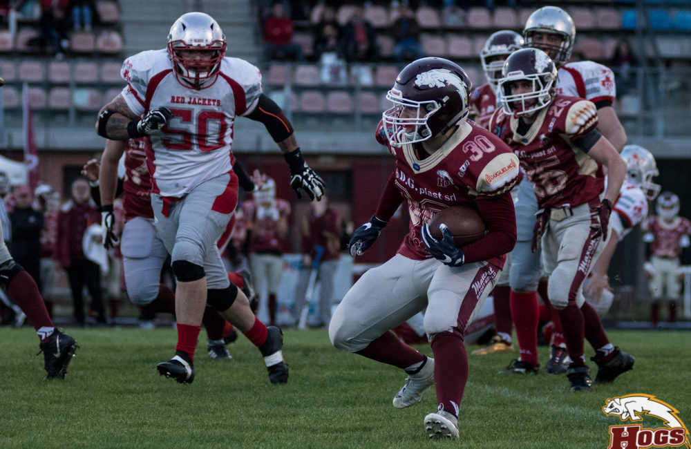
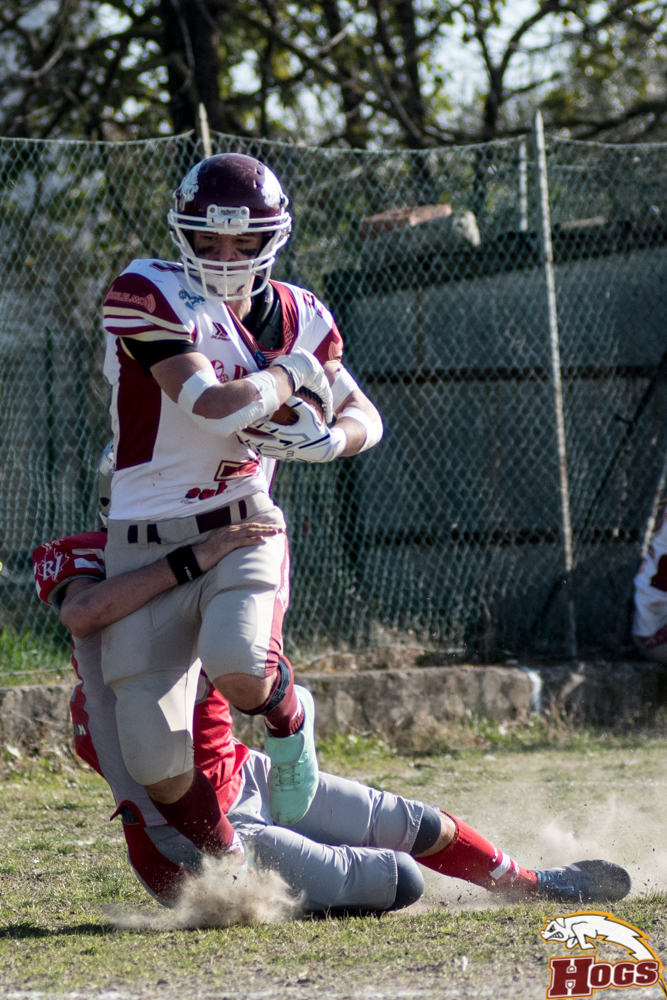
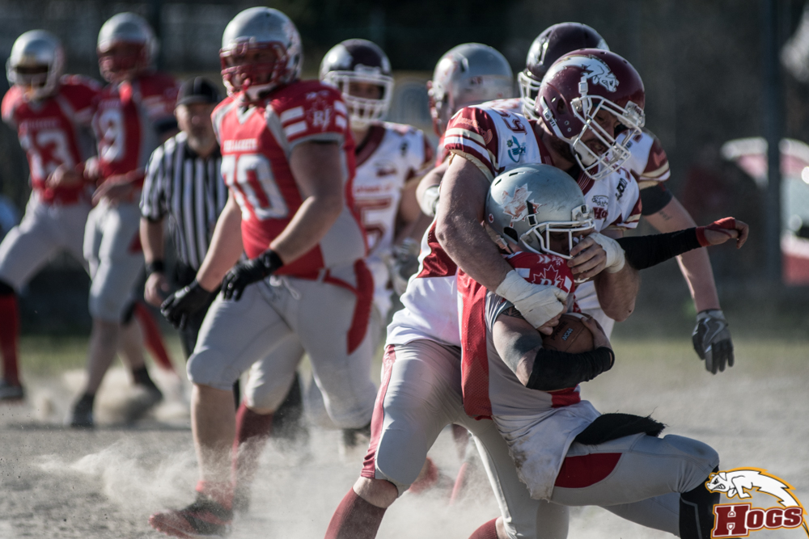

   

Partita davanti al pubblico di casa che termina con un punteggio non altissimo: Hogs 20- Red Jackets 12.  
Nel loro primo drive i DG Plast Hogs sono subito costretti al punt ed arriva immediatamente una doccia fredda. Red Jackets che partono dalle loro 20 difensive: invenzione su corsa del QB Buchi che brucia 40 yards. Chiude subito su corsa Bassani e immediato vantaggio degli ospiti che però falliscono l’extra point: Hogs 0 Red Jackets 6. Gli Hogs dopo due primi down chiusi un poco a fatica arrivano nella red zone avversaria e pareggiano con Fiorillo: non entra il calcio di Cebotaru e punteggio 6 a 6.  
Un intercetto di Caccialupi riconsegna la palla all’attacco, così inizia il 2° quarto dalle 30 difensive. L ‘attacco degli Hogs macina yards e segna col rientrante N’Dori. Il calcio di Cebotaru porta il vantaggio sul 13 a 6.  

  

   

Dopo un punt degli ospiti gli Hogs costruiscono un bel drive con ben 4 runningback coinvolti, completano un bel lancio su Montecchi, ma commettono fumble nello scambio fra il QB Ruozzi Alex il  fratello RB Luca. Torna in campo l’attacco ospite però non capitalizza, in quanto arriva il secondo intercetto della difesa reggiana ad opera di Borsari . Si arriva così all’intervallo.  
  
Al rientro in campo la difesa granata costringe subito al punt i Red jackets. Stavolta i porcellini partono col piede giusto: chiudono 3 primi down consecutivi e poi arriva il TD di Fiorillo. Ancora buono l’extra point e massimo vantaggio: 20 a 6. I Red Jackets arrivano nella red zone degli Hogs e ad inizio del 4° quarto con una corsa di 4 yard è lo stesso Buchi a segnare. Punteggio ora sul 20 a 12. Ancora tempo per qualche azione di attacco da entrambe le parti, ma allo scadere del tempo gli Hogs non riescono a chiudere l’ultimo td. W sul tabellino di marcia, ma i padroni di casa sono andati a corrente alternata.  

  

   

Qualcosa da registrare sicuramente in tutti i reparti, ma bisogna dar merito anche all’ottima prestazione dei Red Jackets, che sicuramente meriterebbero di più di una sola vittoria all’attivo.  
Ora finale da brivido per i giovani porcellini, attesi dalla trasferta di Roma contro i Pretoriani e poi dal sentitissimo derby coi Vipers Modena che chiuderà la regular season: rispetto per tutti, ma paura di nessuno, i DG Plast Hogs sono in testa al girone imbattuti dopo 6 incontri e non può essere un caso.  
  
   
*Ufficio Stampa Hogs Reggio Emilia*