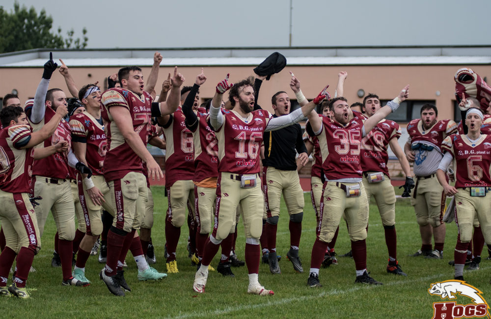
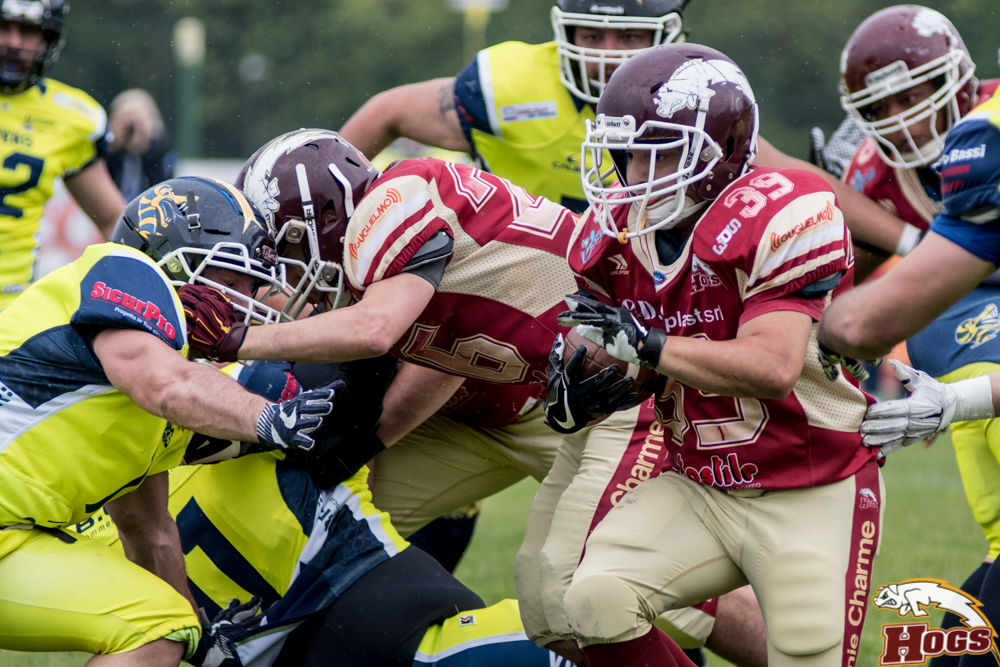

   

Certe partite di football ti costringono a rimanere fino alla fine a guardarle, allo stadio o davanti ad uno schermo. A dispetto del punteggio di 17 a 0 ottenuto contro i Vipers Modena, la vittoria degli Hogs è proprio stata una di quelle partite.  
Fino a metà dell’ultimo quarto solo 3 punti dividevano le due squadre e decideva il field goal di Cebotaru nel primo tempo. Mostruose le prestazioni delle due difese con Cardile (Vipers) e Morlini (Hogs) a contendersi la palma di miglior difensore.  
Approccio offensivo molto più equilibrato dei Vipers, che spesso hanno schierato due corridori nel backfield. Hanno azzardato qualcosa in più del solito gli Hogs su lancio con Montecchi e Fiorillo a ricevere le imbeccate di Ruozzi.  
Proprio da una ricezione di Montecchi da 30 yard era scaturita la posizione di campo che aveva permesso a Cebotaru di segnare i primi punti su field goal. Da qui dominio delle difese, che hanno concesso qualcosa ai drive degli attacchi, ma obbligandoli poi alla fine al punt.  
Si è giocato come nei play off, con finte di punt e quarti down giocati alla mano. Nel drive di apertura del 3° quarto gli Hogs macinano sino ad arrivare ad un primo e goal dalle 5 yard. Addirittura recuperano un fumble vicinissimo all’end zone, ma al 4° tentativo il ginocchio di Fiorillo tocca terra uno sputo di millimetri prima della end zone e i Vipers si salvano.  
Nell’ultimo quarto dopo il field goal stoppato dai Vipers, sembra ripresentarsi la stessa trama : attacchi che faticano su ogni yard, contro difese decisamente superiori. Poi improvvisamente due lampi di talento puro, due touchdown su corsa da 30 yard spezzano l’equilibrio.  
  

  

   

Prima Maestri e poi Sabbioni tirano un uno due che davvero chiude l’incontro . Perfetto Cebotaru nei due calci di trasformazione. In mezzo per la difesa degli Hogs erano arrivati il sack di Fantozzi e l’intercetto di Borsari. Alla fine un’intercetto anche per i Vipers con Gambuzzi, che però nulla toglie alla bella partita del QB Ruozzi.  
Un reparto però degli Hogs merita una citazione particolare, la linea d’attacco. Mazzani, Camorani, Matias ,Raffaelli, Rozzi e Bertagnini hanno spinto faticato e imprecato ogni down contro una linea di difesa nettamente più pesante: una di quelle partite dove ogni yard da guadagnare è in salita. Lo hanno fatto dall’inizio alla fine, come bisogna sempre fare, specialmente nei play off. Già i play off, un traguardo insperato ad inizio anno: e adesso ? Perchè accontentarsi ? Se anche i ragazzini riescono a giocare con questa mentalità, perchè non sognare alla grande?  
  

*Ufficio Stampa Hogs Reggio Emilia*