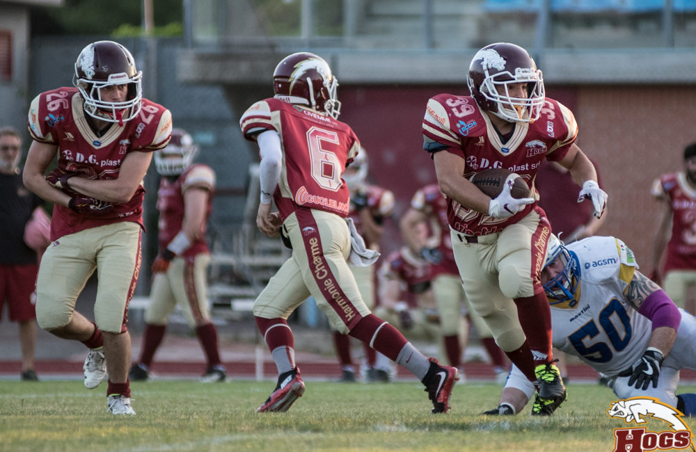
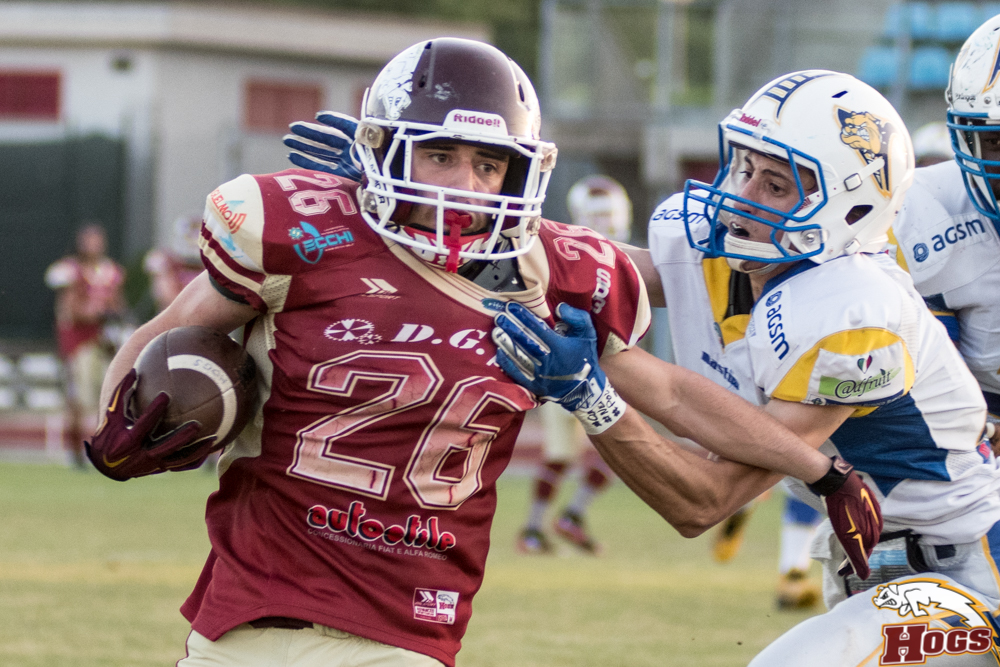

   

Si fa davvero fatica a trovare un difetto nella prestazione dei DG Plast Hogs, che senza mezzi termini dominano il quarto di finale contro i Mastini di Verona.  
34 a 0 il punteggio di una partita che ha sempre visto i porcellini controllare l’incontro, fin dall’inizio. Subito il primo drive degli Hogs non perdona: due bei completi del QB Ruozzi aprono la strada per il primo TD di Sabbioni che si ripete sul finire del primo quarto. 14 a 0 per gli Hogs, coi due extra point di Cebotaru e l’intercetto di Fontana che ferma il drive dei Mastini.  
Nel 2° quarto la difesa dei Mastini mette a segno un’intercetto e ferma due volte l’attacco degli Hogs arrivato a poche yard dalla end zone, ma subisce altri due TD stavolta ad opera di Buriani.  
Partita un poco sorprendente all’intervallo, anche per il divario di 27 a 0 a favore dei porcellini. Nessun calo di tensione nel secondo tempo, in cui arrivano ben 3 intercetti della difesa reggiana ad opera di Dobelli, Baldini e Simula. Nel 3° quarto lo spettacolare ritorno di punt di Maestri, posizione gli Hogs dentro la red zone e lo stesso maestri segna il 5° TD. Nemmeno nell’ultimo quarto l’attacco ospite riesce a trovare la segnatura e la difesa degli Hogs mantiene inviolata la propria end zone.
Chiave di volta dell’incontro è stata la velocità dei giocatori degli Hogs, che ha avuto la meglio sui Mastini, decisamente superiori come peso. I due reparti degli Hogs, che avrebbero dovuto essere più in difficoltà, linea d’attacco e di difesa, hanno sfoderato una prestazione incredibile.  

 

   

In attacco Mazzani, Camorani, Matias, Raffaelli, Rozzi e Bertagnini hanno consentito a ben 6 RB degli Hogs di guadagnare terreno.  
  
In difesa Bedogni, Punzo G. Battistini, Morsiani e Amparo hanno retto l’impatto della pesantissima linea dei Mastini e consentito al resto della difesa di compilare un tabellino fantastico: 4 intercetti, un sack, 3 lanci deflettati e tantissimi placcaggi.  
Meritavano di essere citati tutti questi giocatori, che difficilmente segneranno mai dei punti, ma oggi hanno davvero costruito le basi per la vittoria.  
  
Ora i porcellini lasciano Scandiano per andare a giocare la semifinale a Milano, contro i Rhinos, partita sulla carta proibitiva, ma davvero questa banda di ragazzini, potrebbe riservare ancora delle sorprese.  
gennaroA margine di tutto, a fine partita, standing ovation per Diego Gennaro linea di difesa dei Mastini, che per limiti d’età ha disputato la sua ultima partita di campionato, ma non appende il casco al chiodo: a 48 anni, per pieno merito sportivo è nuovamente stato convocato in nazionale dove veste da anni la maglia di capitano. Tanti auguri ad una delle migliori linee di difesa del campionato italiano.  
   
  
*Ufficio Stampa Hogs Reggio Emilia*