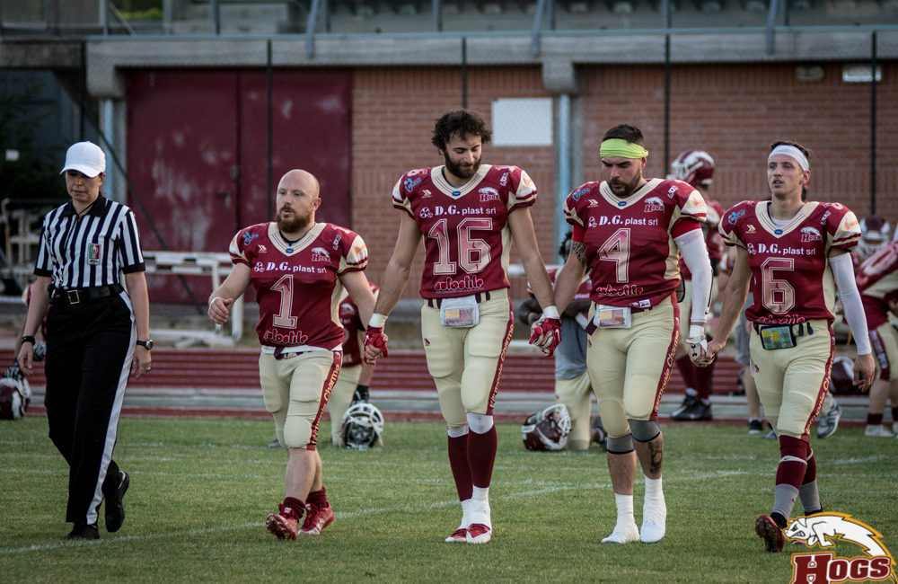
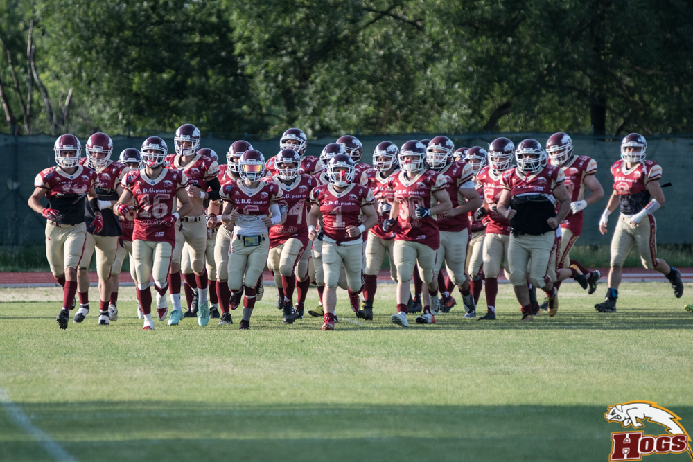

 

Finalmente si sono definiti gli accoppiamenti delle semifinali del campionato. Le fantastiche 4 sono Rhinos Milano, Daemons Martesana , Pretoriani Roma e i DG Plast Hogs.
La squadra di Reggio Emilia viene criticata dal football italiano perché legata da oramai vent’ anni allo stesso modulo d’attacco, poco spettacolare perché basato su finte e corse.
Allo stesso tempo è una delle poche squadre in Italia che da vent’anni continua a buttare in campo come titolari dei ragazzini provenienti dal loro settore giovanile.  
Si la dirigenza dei porcellini e il loro coaching staff ammettono queste “colpe” e dichiarano di voler continuare lungo questa strada. Ospite a sorpresa delle semifinali,  in quanto nei pronostici non erano accreditati della post season, i reggiani hanno vinto 7 delle 8 partite in calendario con una media di 10 punti di scarto, dimostrando davvero di non mollare mai fino all’ ultimo minuto.Morlo
L’entusiasmo dei giovani è fondamentale per questo gruppo, ma domenica non si scherza: si va a far visita ai Rhinos, praticamente una squadra di prima divisione senza americani in campo.  
Nei pronostici non se ne esce: i milanesi si presentano all’ appuntamento con numeri da paura. Primo attacco e prima difesa del campionato. Un QB, Ines, oltre le 1500 yard lanciate, un Difensive Lineman, Carbone primo per sack e tacle for loss.
In partite come questa, sembra una banalità, bisogna cercare proprio di non commettere errori e, se non davanti, cercare di rimanere vicini nel punteggio.  
Il possesso della palla sarà fondamentale per l’attacco degli  Hogs, per tenere fuori dal campo un attacco che in un paio di giochi potrebbe arrivare in red zone.
Nei quarti di finale, contro i Mastini, l’offense reggiana è rimasta in campo per ben 30 minuti contro i 18 degli avversari. Il coach dell’attacco Lazzaretti se lo auspica” Contro i Mastini-dice Lazzaretti- abbiamo davvero dato molto respiro alla nostra difesa. A differenza di altre partite non abbiamo messo a segno dei big play, ma costruito dei lunghi drive con guadagni costanti e consistenti. Probabilmente ci apprestiamo a sfidare la miglior difesa del campionato e quindi non sarà sufficiente ripetere la bella prestazione dei quarti: l’ho detto ai ragazzi che dovranno giocare ancora meglio. Dovranno dare di più contro un avversario più forte.”
Certo non si prospetta più facile l’impresa della difesa che affronta una linea d’attacco imponente e un qb preparato, molto bravo a giocare anche sotto pressione.  
  
  
 

   

Coach Rossi cercherà di schierare i suoi giovanissimi  nel miglior modo possibile, per contenere gli avversari e cercare di ripetere qualche big play come fatto vedere contro i Mastini Verona.  
Non si arriva in semifinale per caso, se poi domini in quasi tutte le statistiche del campionato, chi viene in casa tua sa che lo aspetta una giornata lunga e pesante.    L’appuntamento è per domenica sera alle ore 18 allo Stadio Comunale Gianni Brera di Pero (MI), una trasferta più che accessibile per i tanti tifosi che seguono il football americano targato RE.  
  

*Ufficio Stampa Hogs Reggio Emilia*