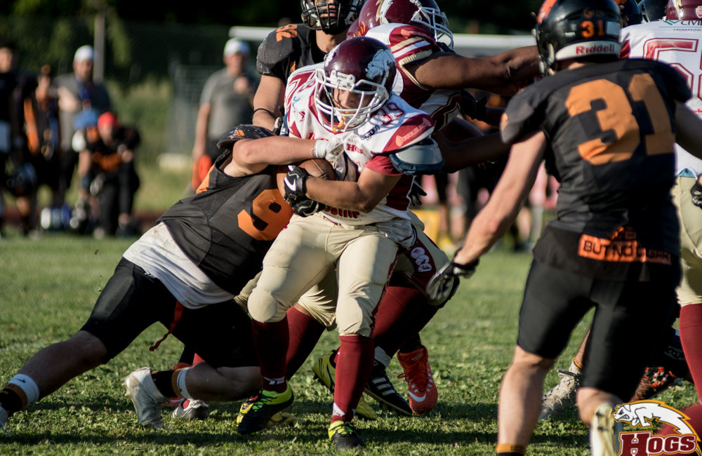
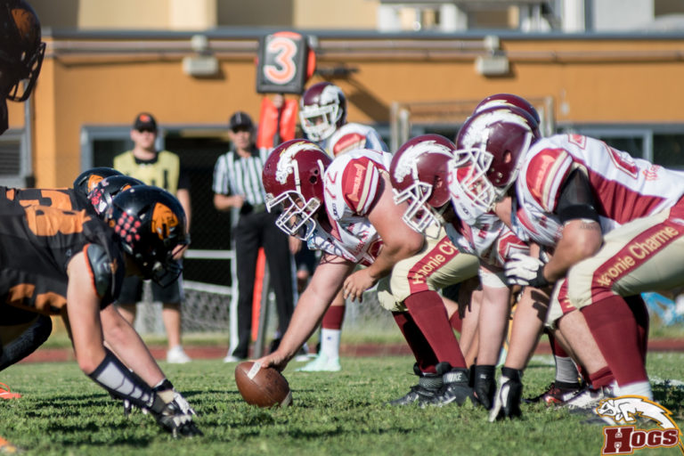

 
Nel football americano forza e velocità sono fondamentali. Quando il tuo avversario è più forte e più veloce, sorgono dei problemi e la giornata diventa lunga.
I DG Plast Hogs sono scesi in campo contro la prima difesa del campionato e il primo attacco, i Rhinos Milano che meritatamente accedono alla finale battendo i porcellini per 28 a 9. Milanesi sempre in controllo e che dopo un drive che li vede costretti al punt, trovano i primi punti con una bella connessione fra Ines ed Elmi. Il piede di Arioli non sbaglia e alla fine della giornata registrerà 4 trasformazioni su 4 tentativi.
Hanno giocato il tutto per tutto gli Hogs, anche un 4° tentativo e pollici nel primo quarto, non convertito. La difesa dei porcellini aveva tutto sommato retto, ricoprendo un fumble con Morlini: su un suo placcaggio era costretto ad uscire il regista titolare Ines, che non rientrerà. Non risulterà un vantaggio. Il ricevitore Elmi, schierato come QB, completerà sul corto, ma con le sue corse presenterà un’attacco molto diverso, ma non per questo meno pericoloso. Proprio lui segna personalmente il secondo TD.  
  

 
  

  
   

Solo ora, sul 14 a 0 l’attacco reggiano riesce a chiudere per la prima volta il down, ma quanta fatica. In apertura di 3° quarto, contro un fronte difensivo molto corto, Ruozzi serve il TE Iotti ed arriva un’importante guadagno di 30 yard. Gli Hogs vedono finalmente le ultime 20 yard, ma non vanno oltre: il piede di Cebotaru da i primi 3 punti. Si carica la difesa ( Morlini e Fantozzi su tutti) e costringe subito al punt i Rhinos. Il pallone non è molto profondo, ma davvero alto. Maestri tenta il controllo in velocità, ma la palla gli sfugge e la ricoprono i Rhinos. Doccia gelata per gli Hogs ed arriva anche la terza segnatura su corsa di Gogat.  
Si riscatta all’inizio del 4° quarto Maestri con un ritorno fino alle 40 difensive. Sabbioni e Buriani ( probabilmente il migliore in attacco) danno finalmente continuità al gioco di corsa che finalizza con una corsa laterale da 7 yard proprio di Maestri. Non riesce l’extra point, e si è sul 21 a 9 per i Rhinos.  
Mancano più di sette minuti, ma i Rhinos iniziano a “mangiare” il tempo ed è ancora
corsa BurianiGogat a sfondare da poche yard.  
  

Non mollano comunque i porcellini e una corsa di Sabbioni da 30 yard li porta di nuovo dentro le 20 yard difensive, ma arriva l’intercetto dei milanesi che chiude definitivamente l’incontro.  
Vittoria meritata quindi dei Rhinos, che possono contare su un’organico di categoria superiore. Un pò d’amaro in bocca per i porcellini, che comunque hanno disputato una bella stagione, rovesciando i pronostici che non li davano nemmeno presenti alla post season. Uno degli aspetti più positivi è sicuramente l’aver dimostrato di non mollare mai, anche sotto nel punteggio, nè in attacco nè in difesa.  
  
Molto più consistente e costante il supporto degli special team. Possiamo solo ringraziare questo branco di giocatori, partiti senza troppe fanfare attorno, e che, partita dopo partita sono arrivati ad un passo dalla finale. Oggi era quasi una missione impossibile: quasi. Il prossimo anno, lavorando più duramente chissà. Nello sport difficilmente ti regalano qualcosa: te lo devi andare a prendere, allenamento dopo allenamento.  

*Ufficio Stampa Hogs Reggio Emilia*
  