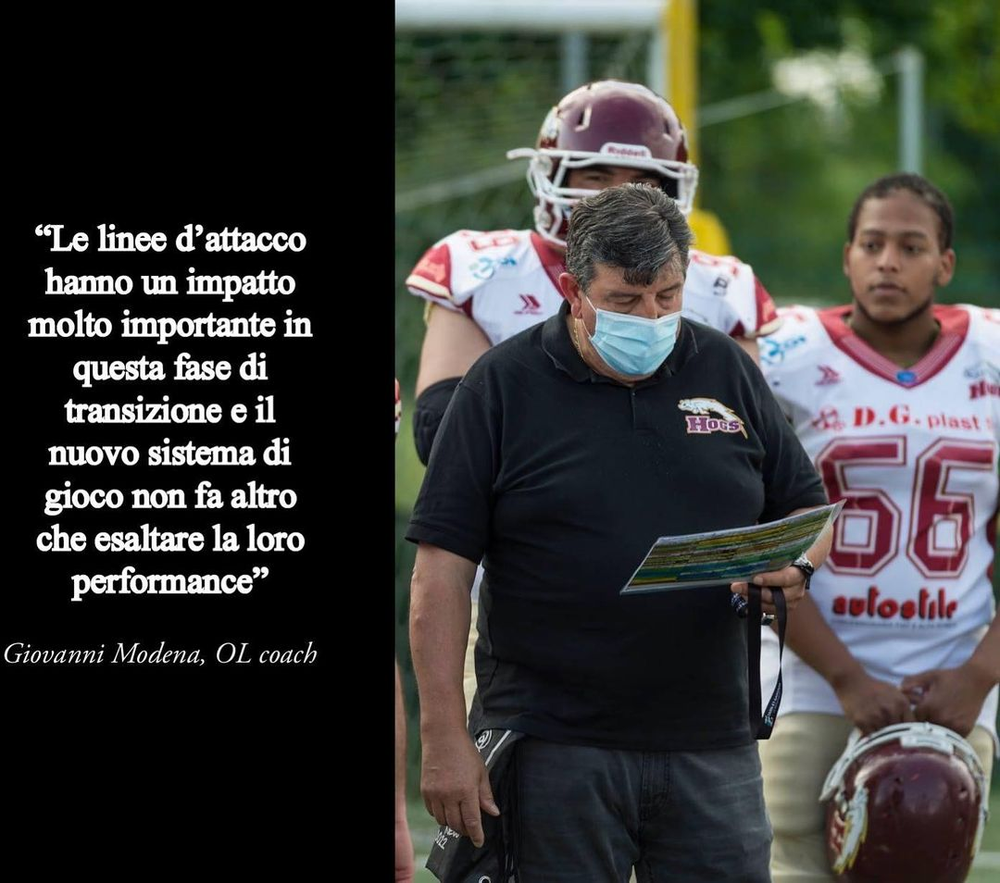

 

Questo è un anno di grandi cambiamenti per gli Hogs che vedono il coaching staff completamente rinnovato, o quasi.⁣⁣⁣⁣⁣  
Come ci dice coach Giovanni Modena, figura stabile ormai da tre anni tra le file granata *“cambiare offensive e defensive coordinator è una scelta per la crescita della squadra. I giocatori hanno reagito al di sopra di ogni aspettativa e le numerose presenze agli allenamenti ne sono la prova⁣"*.  ⁣⁣⁣⁣⁣  
⁣⁣⁣⁣⁣  
⁣⁣⁣⁣⁣Coach Modena porta avanti il settore giovanile, che nella stagione appena terminata ha portato grandi soddisfazioni, *”sono molto fiero di essere stato HC della giovanile, hanno raggiunto ottimi risultati arrivando in finale.”* ⁣⁣⁣⁣  
*"Sono emersi diversi talenti che militeranno in prima squadra, i giovani si sono ben amalgamati con la squadra senior, molto probabilmente già da quest’anno alcuni saranno titolari.⁣⁣⁣⁣⁣”* ⁣⁣⁣⁣⁣  
⁣⁣⁣⁣⁣⁣⁣⁣⁣⁣  
Da Head Coach in giovanile, Giovanni diventa⁣⁣⁣⁣⁣
Offensive Lineman Coach nel senior team, *“le nostre linee di attacco sono il reparto con cui si è molto lavorato negli ultimi 3 anni, hanno un impatto molto importante in questa transizione e il nuovo sistema non fa altro che ⁣esaltare la loro performance.⁣⁣⁣”* ⁣  
⁣⁣⁣⁣⁣⁣⁣⁣  
Il team d’attacco vede a capo un nuovo Offensive Coordinator e un sistema di gioco completamente nuovo *“con coach Martin stiamo lavorando tutti i giorni per fare in modo che il cambiamento sia semplice e efficace. I giocatori reagiscono  molto bene e con il OC siamo molto sorpresi dall’ottimo livello che stiamo raggiungendo.”⁣⁣⁣⁣*