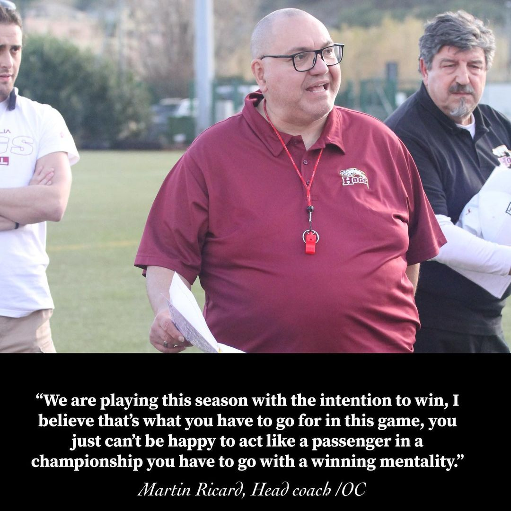

 

Direttamente dal Canada arriva anche il nostro Head Coach, Martin Ricard, che vede però una passato come Defensive coordinator in Germania, Head coach in Francia e Defensive Lineman coach sempre nella nazionale francese.  
⁣⁣⁣⁣  
L’attacco degli Hogs è sempre stato famoso per il suo instancabile gioco di corse, ma con coach Ricard sono arrivati alcuni piccoli cambiamenti che sembrano essere stati ben assimilati dai giocatori, come ci dice lui stesso: *“Abbiamo un gruppo di ragazzi disposti ad imparare, con un buon mix di esperienza e gioventù, con cui è sempre bello lavorare. Hanno un buon livello di competitività cosi come il desiderio di migliorare e questo mi piace. I giocatori sono aperti alle novitá, dobbiamo ancora essere bravi nei fondamentali, la sfida più grande sarà riuscire a padroneggiare il "COME" riconoscere le diverse strutture difensive e "COME" attaccarle in modo efficiente“.*  
⁣⁣⁣⁣  
La mancata qualificazione ai playoff dell’anno scorso, prima volta da quando gli Hogs militano in seconda divisione, è stata un duro colpo, ma coach Martin sta portando grande energia e determinazione, *“abbiamo già chiarito con tutti, quest'anno vogliamo entrare nei playoff e giocare in casa fino alla finale, giocheremo questa stagione con l'intenzione di vincere, credo sia quello che si deve fare,  non si può essere felice di comportarsi da passeggero in un campionato, devi andare con una mentalità vincente, non è arrogante dirlo, lo vedo come un obiettivo comune”*.⁣⁣⁣⁣