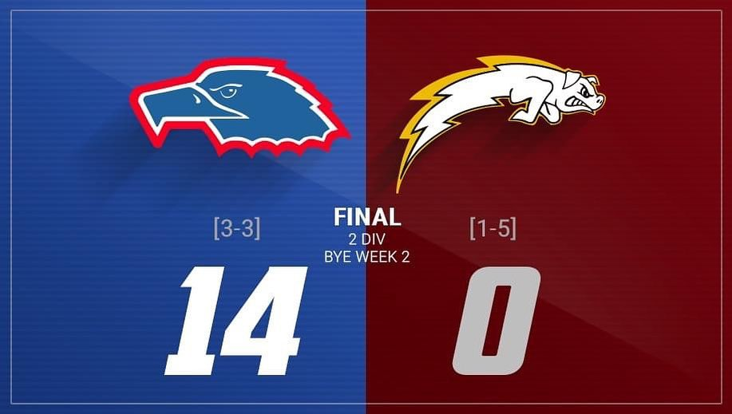

 

E come un deja vu finisce  qua la stagione dei nostri granata, con l’ultima partita in casa delle @aquileferrara , che vincono per 14 a 0, ottenendo così l’ultimo biglietto per i play off.   ⁣⁣
⁣⁣  

Quest’anno gli Hogs hanno affrontato un campionato di transizione, tanti i cambiamenti a partire dall’organico del coaching staff e dei giocatori fino al cambio di strategia di gioco.⁣⁣  
⁣⁣  
Si sa, non è mai semplice apportare modifiche così consistenti e non sempre i risultati sono da subito visibili, ma l’importante è non mollare, non abbattersi e continuare a lavorare finché non si raggiungerà l’obbiettivo. 🐗🏈⁣⁣  
  

**GO HOGS!!!**🐗💪🏻⁣⁣⁣⁣⁣⁣⁣⁣⁣⁣⁣⁣⁣⁣