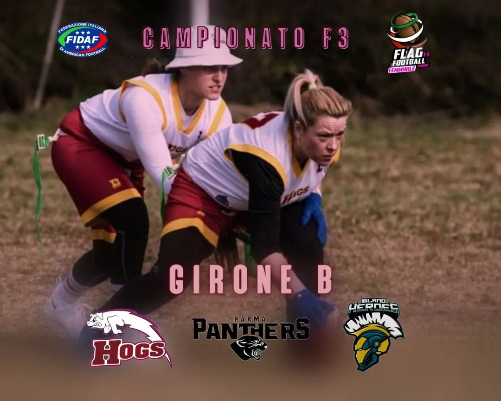

 
  
Ci siamo, il campionato sta per iniziare! 🎉
Quest’anno le squadre iscritte sono 16 e divise in 5 gironi, noi porchette siamo nel GIRONE B assieme a @parma_panthers e @heroesmilano 💪🏼🐷  
  
All’interno di ogni girone verranno disputate sei partite, tutte le squadre partecipanti disputeranno poi ulteriori tre partite in concomitanza della “Final 16” che si terrà a Grosseto dal 9 all'11 giugno 2023.  
  
**CARICA NE ABBIAMO?!?** 💪🏼🏈  
**GO HOGS! GO PORCHETTE!!** 🐷
 
