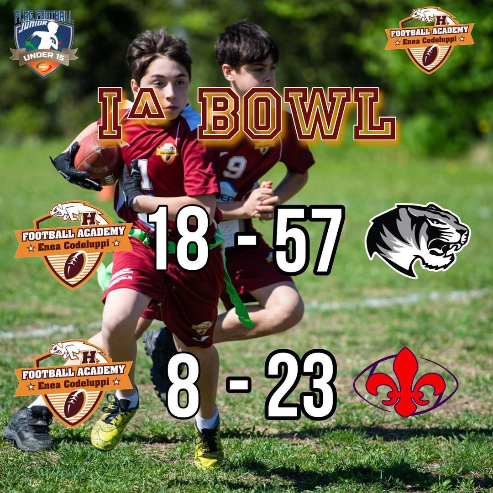

 

Concluso il primo bowl per la squadra U15, che porta a casa due sconfitte ma anche tanta soddisfazione.⁣  
⁣  
Il lavoro da fare è ancora tanto ma all’esordio sono 26 i punti totali segnati per questi giovanissimi atleti, ottimo risultato per una squadra di soli 7 mesi. ⁣  
⁣⁣⁣  
Prossimo appuntamento domenica 30 Aprile sempre sul campo di Via Mogadiscio.  
  
GO HOGS!🏈⁣⁣⁣   

