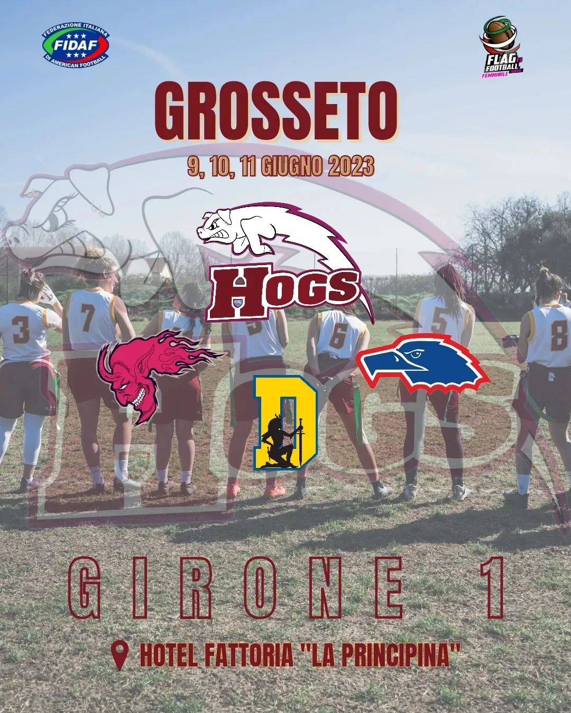
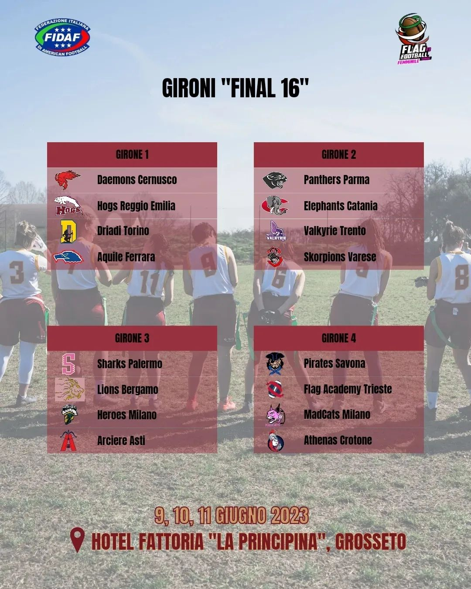

 
  
In questi ultimi mesi abbiamo giocato 6 partite divise in due bowl con il nostro girone, nella fase detta “Divisional”, e così hanno fatto le altre squadre iscritte al campionato 🏈  
  
Tutte le squadre partecipanti disputeranno ulteriori tre partite in concomitanza della “Final 16” che si terrà a Grosseto dal 9 all’11 giugno 2023, per farlo sono state suddivise in quattro gironi da quattro squadre (seconda foto).  
Il nostro é il GIRONE 1, e nella prima giornata affronteremo @daemons.female & @tempeste_bustoarsizio , @driadi.torino e @aquileferrara.  
  
Al termine della fase “Divisional” e della fase “Final 16” si stilerà un ranking da 1 a 16 dove si sommeranno i punti ottenuti dalle squadre.  
  
Alla Final Eight accederanno le prime otto società classificate nel ranking nazionale.
Le franchigie accedenti alla Final Eight verranno suddivise in ulteriori due gironi.
  
Domani si parte,  
**GO HOGS! GO PORCHETTE!!** 🐷  
  

 
