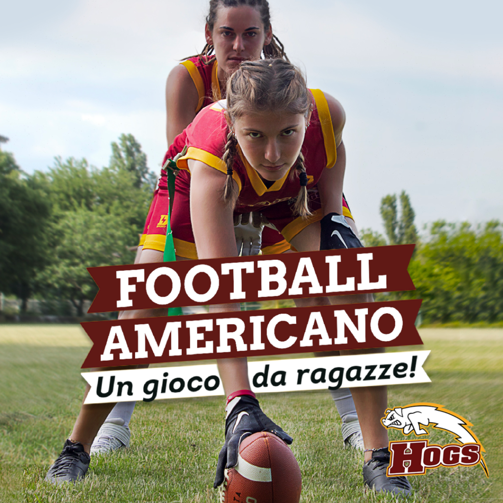
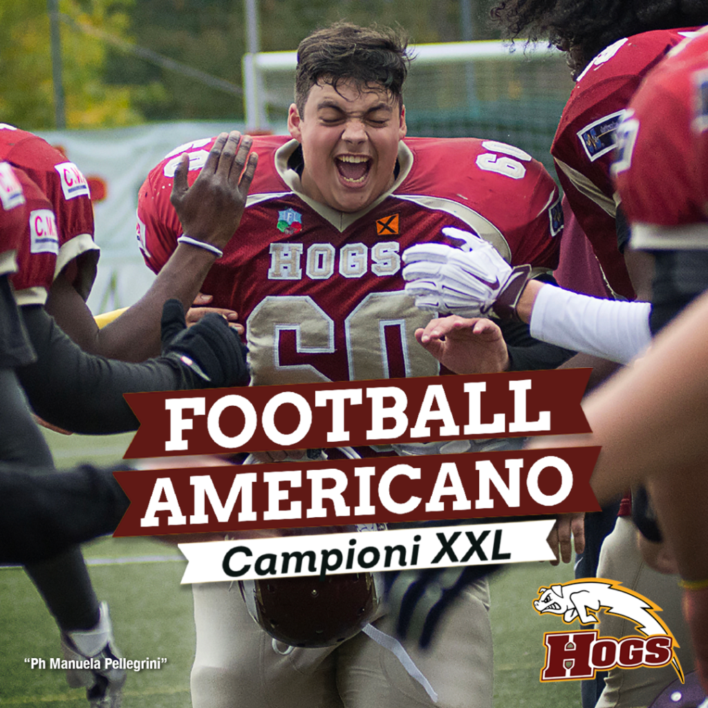
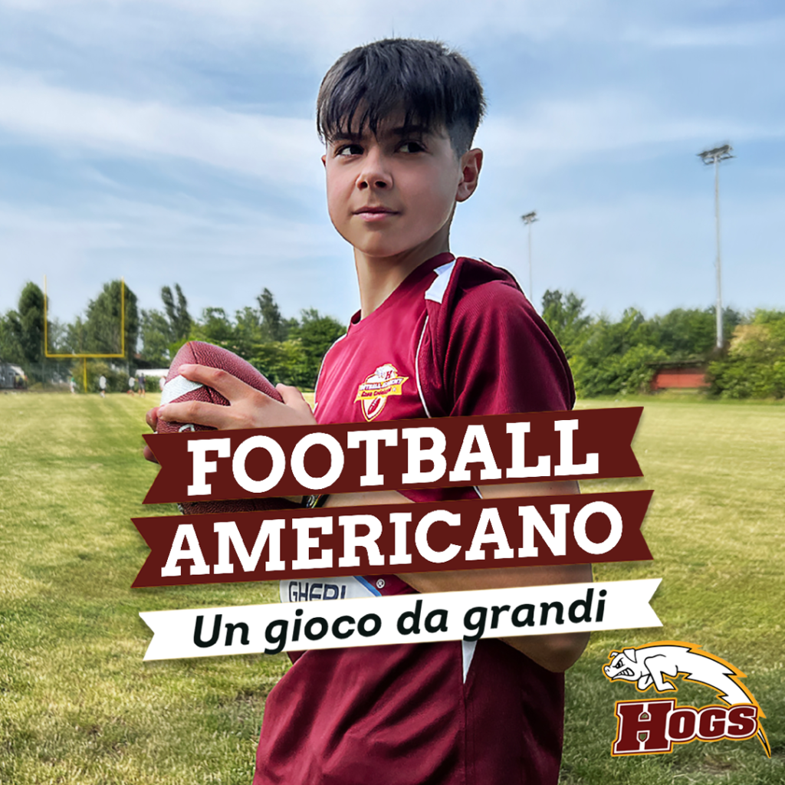

<iframe width="560" height="315" src="https://www.youtube.com/embed/DY2nK-F-Wzs?si=9EmvcFzANKNTbfX3" title="YouTube video player" frameborder="0" allow="accelerometer; autoplay; clipboard-write; encrypted-media; gyroscope; picture-in-picture; web-share" referrerpolicy="strict-origin-when-cross-origin" allowfullscreen></iframe>

 

**Il Presidente Davide Ruozzi: “Cerchiamo ragazzi XXL, ragazze e bambini. Da noi non c’è bullismo e nessuno fa panchina”**

Dal 1984, anno della fondazione, gli HOGS ne hanno fatto di strada. La squadra di football americano della città di Reggio Emilia inizia a preparare i festeggiamenti per i 40 anni di attività e lancia una grande campagna di reclutamento in vista della ripartenza della nuova stagione. Chi sono i modelli e modelle dei manifesti? Leonardo Rozzi, Francesca Zirotti, Giulia Olivieri e Samuele Cilloni, tutti atleti della squadra.  

 

*“Cerchiamo tanto i ragazzi e ragazze con le “ossa grandi”, quanto i piccoli, gracilini, che corrono.”* Ci dice Davide Ruozzi, Presidente degli HOGS – *“Il fisico viene con gli allenamenti e abbiamo visto tanti giovani rinascere. I chili di troppo dei “big man”, per chi sta nella linea di attacco o difesa, diventano un punto di forza e il velocista con i piedi scarsi per la squadra di calcio, ma da noi sarà un ottimo ricevitore. A football americano si gioca in undici in campo, ma c’è una squadra di attacco e una di difesa. Di base servono ventidue giocatori, ma, ad ogni singola azione, puoi cambiare la formazione, c’è spazio per tutti e chiunque ha possibilità di esprimere le sue potenzialità. Abbiamo anche le guerriere, sono diciannove le ragazze che giocano a Flag Football, ovvero il footballa americano senza contatto, e su questo team abbiamo investito parecchio.”*  

 

Viene data la possibilità a tutti di fare una prova gratuita per capire se lo sport piace. “Siamo una decina tra consiglieri e volontari che si occupano della logistica, campi, trovare gli sponsors, curare la comunicazione… Facciamo tutto in maniera volontaria. Abbiamo attiva la prima squadra, le formazioni Under e il Flag misto. Per i più piccoli è attivo a Cavriago il centro di avviamento al Flag Football, senza paraspalle e contatto, e siamo pronti a ripartire anche a Reggio città. Chiunque volesse venire a provare può contattare Federico Scolari al 3289498785 La prova è gratuita ai campi di Via Mogadisco 2. Oppure sul sito <a target="#" href="http:\\www.hogs.it">www.hogs.it</a> si trovano tutte le informazioni.”
Uno sport bilingue che di sicuro piacerà alle mamme. *“Un plus dei nostri allenamenti per i bambini e ragazzi è che sono bilingue italiano-inglese, così che durante la pratica sportiva c’è la possibilità di tenere allenata anche la lingua inglese con i nostri coach madrelingua canadesi e americani.”*  

 

Viene anche garantito l’accesso allo sport a tutti, c’è un progetto per portare i ragazzi al campo e abbassare o togliere il costo delle rette. Ci dice Federico Scolari: *“Abbiamo iniziato un progetto prendendo esempio da un giocatore di origine ghanese professionista dell’NFL, Osi Umenylora. Stiamo lavorando con la comunità ghanese presente a Reggio Emilia, portiamo i bambini e ragazzi a conoscere il football americano considerando che la quota associativa annuale non tutte le famiglie possono permettersi di pagarla. A Reggio Emilia abbiamo un problema serio di avviamento allo sport di bambini di queste famiglie ed è un vero peccato, andiamo a prenderli a casa e in strada per portarli al campo e sono quelli che ci danno di più nelle azioni di gioco.”*  

La campagna di comunicazione è stata affidata ai comunicatori Federica Seghezzi (art director) e Dario De Lucia (digital specialist):*“Ringraziamo gli HOGS per averci dato la possibilità di lavorare insieme, abbiamo trovato dei ragazzi e ragazze meravigliosi e un bellissimo ambiente. La campagna è multisoggetto e multicanale, si basa sulla body positive e sull’invertire gli stereotipi. Siamo voluti uscire dal paradigma dell’atleta muscoloso e “macho” come sinonimo di forza e per andare verso quello di una squadra che cerca ragazzi in sovrappeso, ragazze e bambini da crescere.  I messaggi sono “Campioni XXL”, “Un gioco da ragazze”, e “Un gioco da grandi” e saranno veicolati con una campagna affissioni e attraverso inserzioni a pagamento sui social rivolte ai futuri atleti e alle mamme nel caso dei più piccoli.”*  

**Ufficio Stampa Hogs Reggio Emilia**

  

  