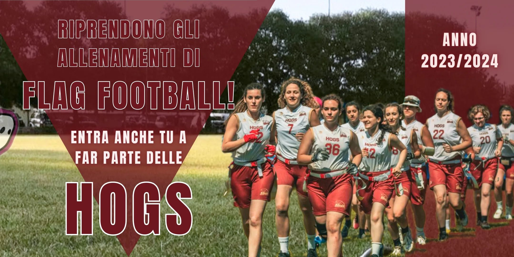

 

Riprendono gli allenamenti di FLAG FOOTBALL femminile! 🏈  
  
Da lunedì 9 ottobre si torna in campo, cariche per questo nuovo anno 2023/2024! 🔥  
  
Se vuoi fare sport e cerchi una squadra amichevole e competitiva, sei nel posto giusto!  
 Siamo alla ricerca di nuove giocatrici per unirsi alla nostra squadra di flag football femminile 🐷  
  
Se hai 16 anni o più e sei curiosa di provare, non aver paura a chiedere informazioni, noi ti aspettiamo!  
  
Non è richiesta alcuna esperienza pregressa!  
 Tutti i livelli di abilità sono i benvenuti.  
 Porta semplicemente la tua energia positiva e la voglia di imparare!  
  
**📅 QUANDO?**  
*Lunedì e Giovedì   
Dalle 20:15 alle 22:15*  
  
**📍 DOVE?**   
*Via Mogadiscio 2, Reggio Emilia  
(Zona Campovolo)*    
      
**GO HOGS! GO PORCHETTE!!** 🐷  
  
