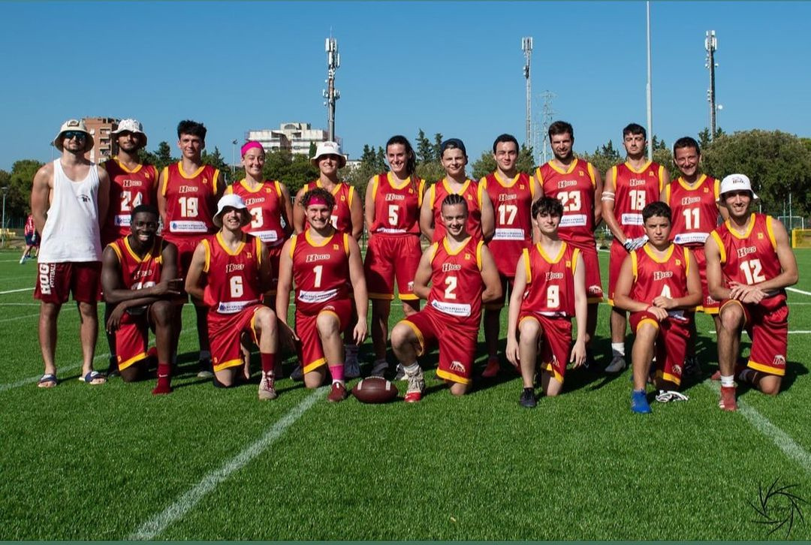

<video width="640" height="480" controls>
  <source src="../img/2023/flag_stagione_2023.mp4" type="video/mp4">
Your browser does not support the video tag.
</video>

 

🏈🎉 Abbiamo concluso il campionato di Flag Football di seconda divisione con un’annata eccezionale!  

Ecco i nostri numeri di quest’anno:   
🏈 12 partite giocate  
🏆 7 partite vinte  
🔝 Un totale di 341 punti segnati. 🙌  
  
Ma non finisce qui!  
Gli Hogs continuano gli allenamenti in preparazione al campionato tackle senior, al campionato giovanile under 18 e al campionato di flag football femminile.  

**Sia che tu sia un veterano o un principiante, c’è un posto per te nella nostra squadra.  
Vieni a far parte della nostra famiglia e prepariamoci per un altro anno di successi e divertimento sul campo!**   
  

 