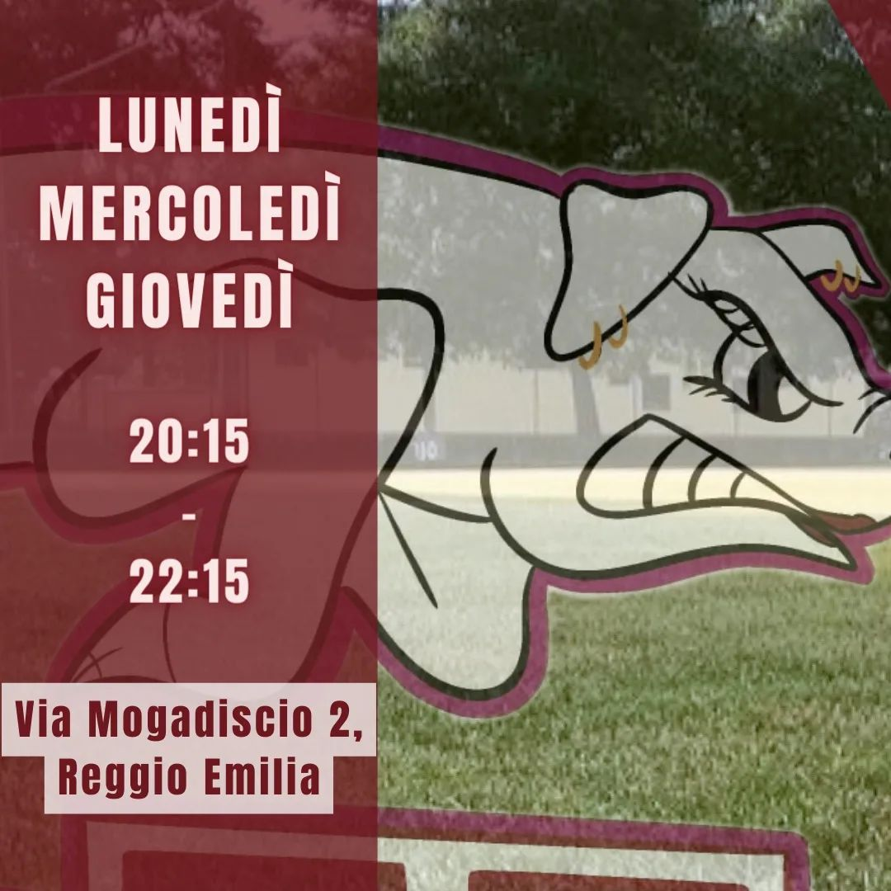
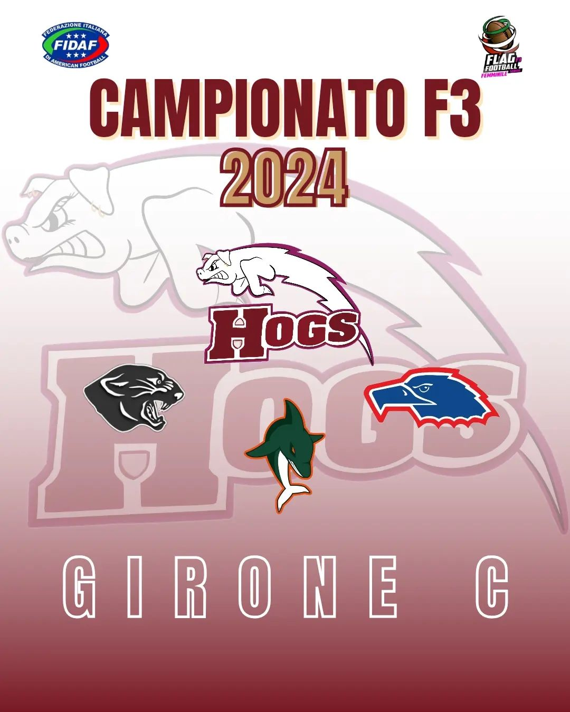

 

Riprendono gli allenamenti di FLAG FOOTBALL femminile! 🏈  
  
Da lunedì 8 gennaio si torna in campo, cariche per questo nuovo anno 2024 🔥   
  
Se hai 16 anni o più e sei curiosa di provare noi ti aspettiamo!  
  
**QUANDO?**  
*Lunedì, mercoledì e giovedì   
Dalle 20:15 alle 22:15*  
  
**DOVE?**  
*Via Mogadiscio 2, Reggio Emilia  
(Zona Campovolo)*  
  
**GO HOGS! GO PORCHETTE!!** 🐷  
  

 