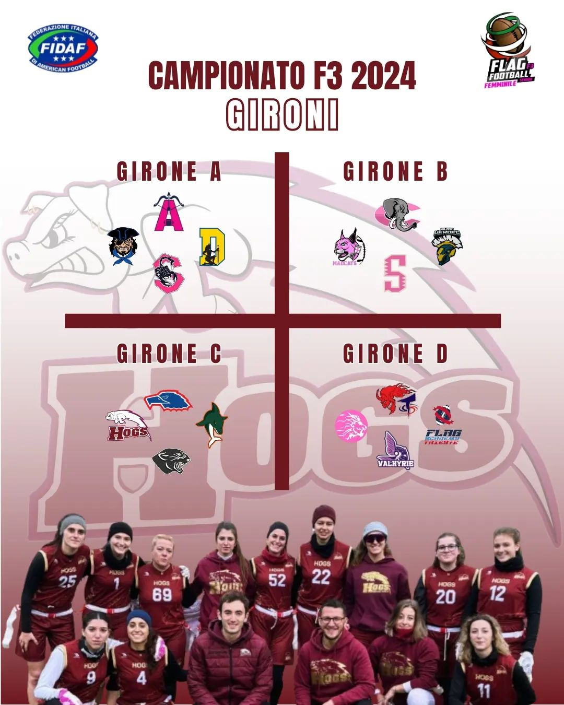

 

Ci siamo, anche quest'anno il campionato sta per iniziare! 🔥   
Quest’anno le squadre iscritte sono 16 e divise in 4 gironi, noi porchette siamo nel GIRONE C assieme a @parma_panthers , @dolphinsancona e @aquileferrara 💪🏼🐷  
  
All’interno di ogni girone verranno disputate sei partite, tutte le squadre partecipanti disputeranno poi ulteriori tre partite in concomitanza della “Final 16” che si terrà a Grosseto dal 7 al 9 giugno 2024.  
  
**CARICA NE ABBIAMO?!? 💪🏼🏈  
GO HOGS! GO PORCHETTE!!** 🐷  
  

 