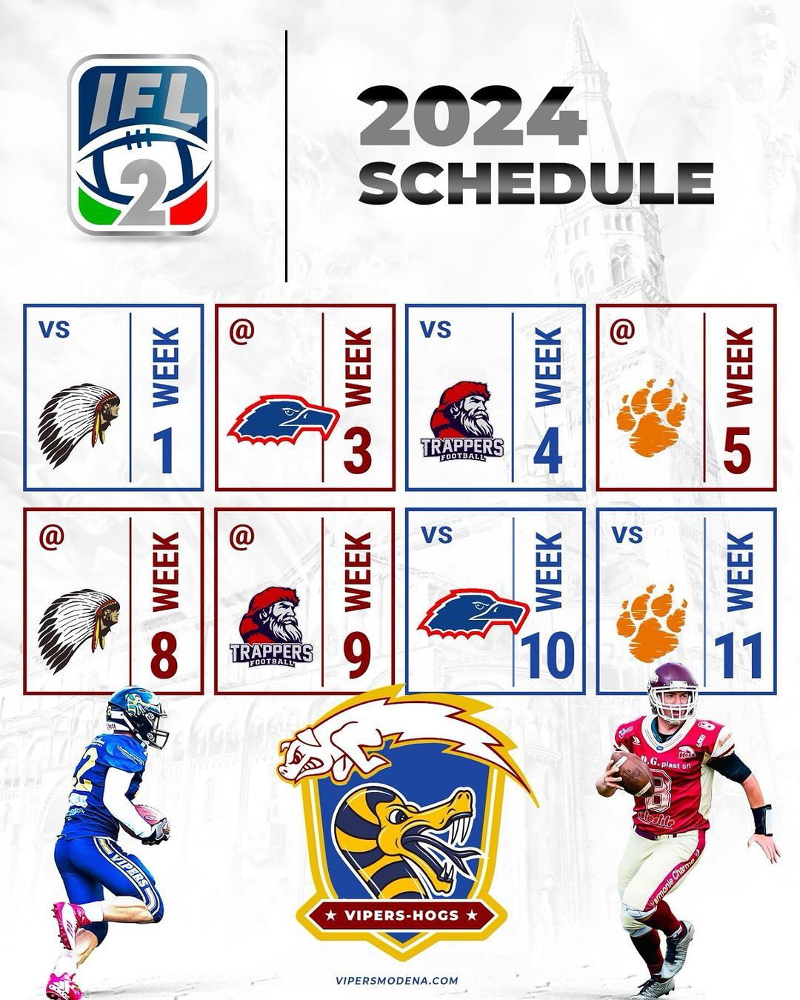

 

13 le squadre iscritte al campionato IFL 2, suddivise in 3 gironi. I Vipers-Hogs si posizionano nel girone A, insieme ad  @aquileferrara , @ravenna_chiefs, @grizzliesroma e @trapperscecina.   
  
Si inaugura il campionato con l’esordio come home team in questo caso sul campo del C.S. Magotti a Modena, contro i Chiefs Ravenna, il 3 Marzo, sede delle successive partite in casa sarà  invece lo storico stadio Torelli a Scandiano, con i Trappers Cecina il 23 Marzo, le Aquile Ferrara il 18 Maggio e Grizzlies Roma il 26 Maggio. I Vipers-Hogs saranno impegnati in trasferta a Ferrara con le  Aquile, il 17 Marzo, a Roma contro i Grizzlies il 6 Aprile, sui campi romagnoli contro i Chiefs il 27 Aprile e a Cecina con i Trappers il 5 Maggio.   
  
Il kick off é alle porte e la squadra é pronta ad affrontare ciò che li aspetta e a dimostrare tutto il potenziale di questa grande unione.  
  
**Ufficio Stampa Hogs Reggio Emilia**

  

  