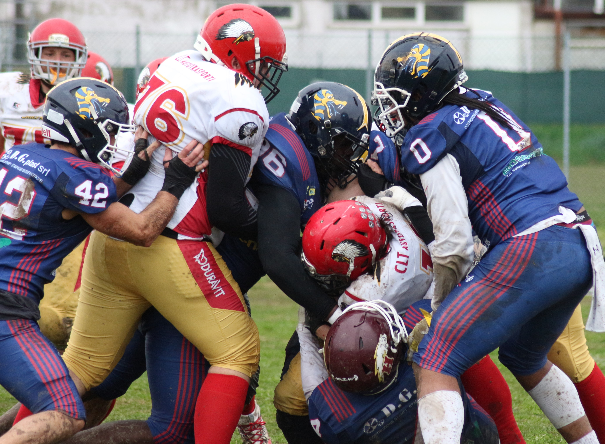

 
ph.Credits: INNA BEREZENSKAYA

 

**Esordio vincente per il team Vipers-Hogs, che in casa ha battuto i Chiefs Ravenna per 30 a 8 con una buona prestazione soprattutto difensiva. Peccato non aver potuto offrire al pubblico una sistemazione degna e delusione per le promesse non mantenute dal Comune a una Società che da anni dà lustro al territorio ed è capace di coinvolgere migliaia di persone.**  

I Vipers Modena, in collaborazione con gli Hogs Reggio Emilia, tornano in campo nel Campionato “All Italian” della Fidaf con una convincente vittoria contro i Chiefs Ravenna, ottenuta soprattutto grazie ad una convincente prestazione del reparto difensivo, cui va il merito di aver segnato due dei quattro TD dell’incontro.  

*“E’ stata una partita dai due volti”*, ha commentato Mauro Solmi, Head Coach e Defensive Coordinator del Team. *“Di fronte ci siamo trovati una squadra di valore che, al netto delle difficoltà nel primo quarto, poi ha dimostrato di saper tenere bene il campo, mettendoci in difficoltà. Una vittoria è sempre una vittoria, ma io non sono contento di come abbiamo giocato, malgrado il risultato ci premi. Abbiamo commesso tanti errori, sia in attacco che in difesa e quello che ho visto in campo non rispecchia assolutamente il nostro modo di giocare. Abbiamo poco tempo per preparare la prossima partita contro le Aquile Ferrara, sicuramente i “primi della classe” nel nostro girone e in IFL2 e sarà subito un’occasione importante per dimostrare davvero di che pasta siamo fatti”.*  

Veniamo dunque alla partita, iniziata immediatamente con il big play difensivo di Riccardo Gambuzzi, che a poco più di un minuto dal kick off intercetta il QB avversario e si invola in touchdown per i primi 6 punti della stagione. Non riesce il calcio di trasformazione di Marius Chiriac ma, poco dopo, altra magia della nostra difesa, che recupera palla su un fumble e varca nuovamente l’endzone dei Chiefs per il raddoppio. Chiriac questa volta non sbaglia e l’inerzia resta tutta dalla parte dei Vipers-Hogs, che chiudono il primo quarto di gioco con un’altra segnatura (una corsa di Giovanni La Rocca) e un’altra trasformazione di Chiriac: 20 a 0. E’ a questo punto che arriva la reazione difensiva dei Chiefs, che non si fanno più sorprendere e, nel terzo quarto, provano ad accorciare le distanze con un TD pass vincente e relativa trasformazione da due punti per il 20 a 8. L’attacco dei Vipers-Hogs torna in cattedra nell’ultima frazione di gioco, con Emanuele Daino che lancia per le mani di Luca Minopoli per l’ultimo TD di giornata e Chiriac che arrotonda il risultato con un’altra trasformazione da un punto e con un field goal a cinque minuti dal fischio finale:  

30 - 8
 

In archivio questo esordio vincente, veniamo alle dolenti note, tutte legate alla frustrazione di non poter contare, in una città come Modena, su di un impianto adatto ad ospitare pubblico per eventi nazionali di questa caratura. A parte lo Stadio Braglia (che naturalmente è off limits per tutti salvo che per il Modena Calcio), sembra impossibile ma questa è la situazione e, dopo due anni di promesse mai mantenute, il team del Presidente Montaruli sarà costretto a giocare “in casa” le prossime partite a Scandiano (RE), grazie alla collaborazione degli Hogs Reggio Emilia. *“Se il pubblico non può assistere alle partite da una tribuna coperta, allo stadio non viene….e il nostro sport, che ha nel “quinto tempo” il suo momento più bello e coinvolgente, ne risulta enormemente penalizzato (senza contare la perdita economica a ciò connessa)”*, ha commentato il Presidente.  

Non è mai bello aprire una stagione con una polemica, ma le promesse fatteci all’indomani del titolo di Seconda Divisione, vinto nel 2021, in merito alla costruzione della tribuna al CS Magotti restano tali. Nel 2022, promossi in Prima Divisione (IFL) i Vipers furono costretti a peregrinare per tutta l’Emilia per poter rispettare i requisiti imposti dalla Federazione per il salto di categoria e per una Società che continua ad investire e a credere nel territorio, ritrovarsi nel 2024 allo stesso punto di partenza è un boccone veramente amaro da mandare giù.  

Confidiamo ancora nelle istituzioni, tuttavia, e ci aspettiamo che il nostro appello venga finalmente accolto e gestito nei tempi utili dal Comune e dall’Assessorato allo Sport, perché Modena è la nostra Città ed è qui che vorremmo continuare a giocare.  

**Ufficio Stampa Vipers-Hogs**

  

  