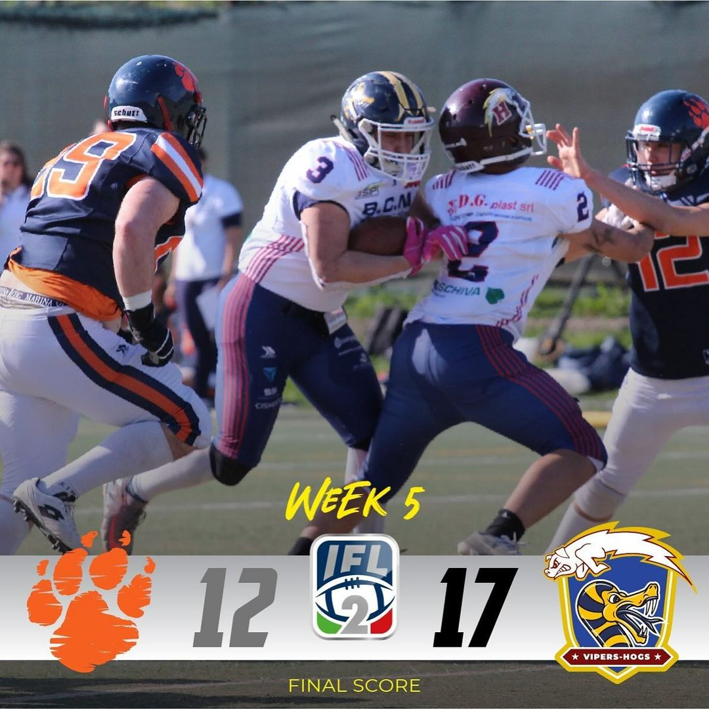
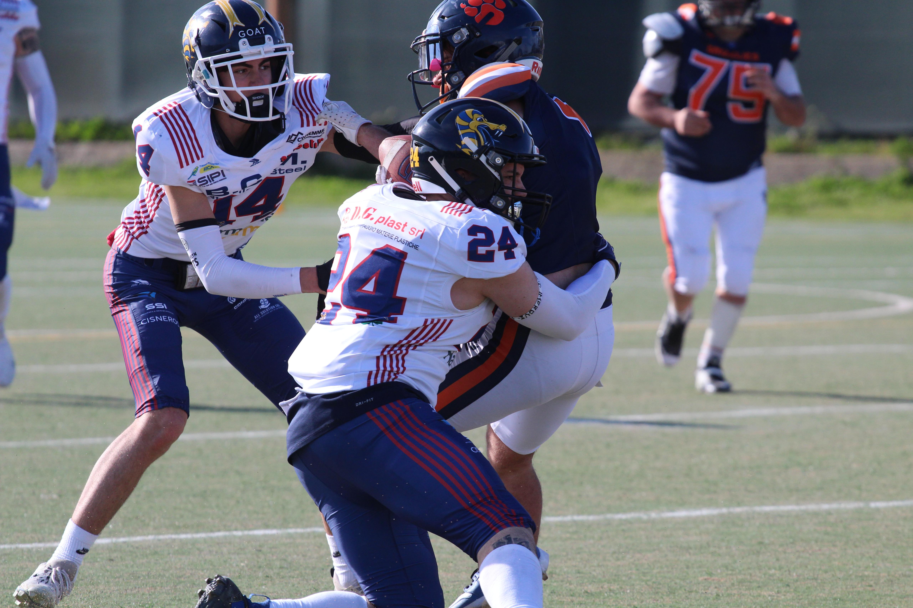
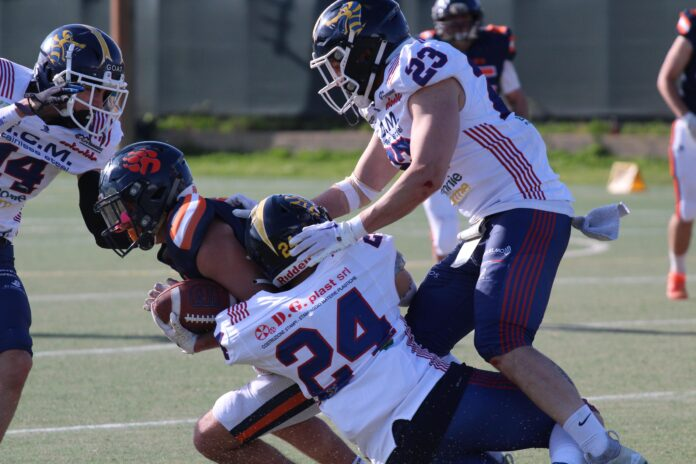

 

 

**I Vipers-Hogs portano a casa il bottino pieno nella difficile trasferta a Roma contro i Grizzlies, battuti per 17 a 12 malgrado le assenze importanti. Terza vittoria stagionale e secondo posto in classifica nel Girone A.**    
  
I Vipers-Hogs tornano da Roma con una vittoria che vale il secondo posto in classifica nel Girone A, ma con una prestazione che non può e non deve soddisfare: la sveglia all’alba, il viaggio, le assenze e i tanti errori commessi hanno pregiudicato una partita che, malgrado la vittoria, andava affrontata e giocata in modo diverso. *“Quella di sabato è stata certamente in assoluto la peggior partita da noi giocata sino ad oggi* – ha commentato coach Mauro Solmi. *“Sono stati fatti errori di assegnamento ed esecuzione, che già stiamo analizzando. Non abbiamo fatto nulla di quanto avevamo preparato e abbiamo fatto un grosso passo indietro rispetto alle ultime due partite giocate. Non guardo il risultato, perché in un caso come questo è certamente importante ma non racconta di un match combattuto e affrontato al meglio delle nostre possibilità. Dobbiamo ripartire da zero, dai fondamentali e per fortuna abbiamo tre settimane di tempo per preparare la partita contro Ravenna, tappa fondamentale per il nostro cammino in questa stagione.”*  
  

 
ph.Credits: LIDA GIOVANARDI

   
  
Il racconto della partita parte da un primo quarto in cui le difese hanno controllato bene gli attacchi avversari, con il punteggio che si è mosso in nostro favore solo grazie al field goal di Marius Chiriac. Poco o niente da raccontare anche nel secondo quarto, finito 0-0 e squadre negli spogliatoi senza regalare spettacolo.  
  

 
ph.Credits: LIDA GIOVANARDI

   
  
Nella ripresa, due gli acuti da segnalare, i touchdown su ricezione di Andrea Gatti su pass di Emanuele Daino e dello stesso Daino su corsa, con conversioni su calcio a segno grazie al piede di Chiriac. Sul punteggio di 17 a 0 per i Vipers-Hogs, però, arriva la reazione dei Grizzlies, che prendono in mano le redini del gioco e tentano la rimonta, andando due volte a segno nell’ultimo quarto di gioco, mancando però entrambe le trasformazioni. La partita si chiude sul 17 a 12 che regala la terza vittoria stagionale al nostro team, consolidando la seconda posizione ma che, come sottolineato dal nostro Head Coach, ha evidenziato la mole di lavoro che ancora attende la squadra per poter essere realmente competitiva.  
  

 
ph.Credits: LIDA GIOVANARDI

   
  
Prossimo appuntamento, dunque, sabato 27 aprile a Ravenna, contro i Chiefs, con kick off alle ore 20.30.   
  
**Ufficio Stampa Vipers-Hogs**
  

  